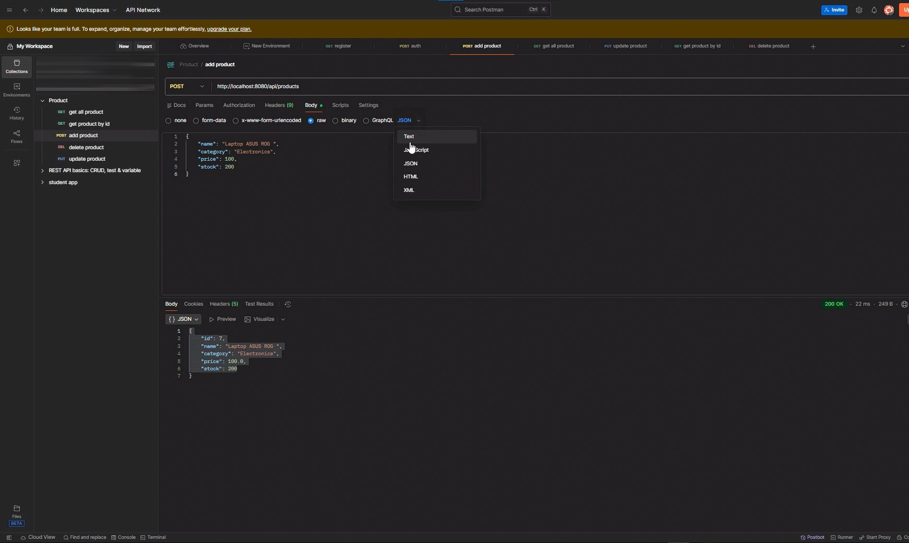
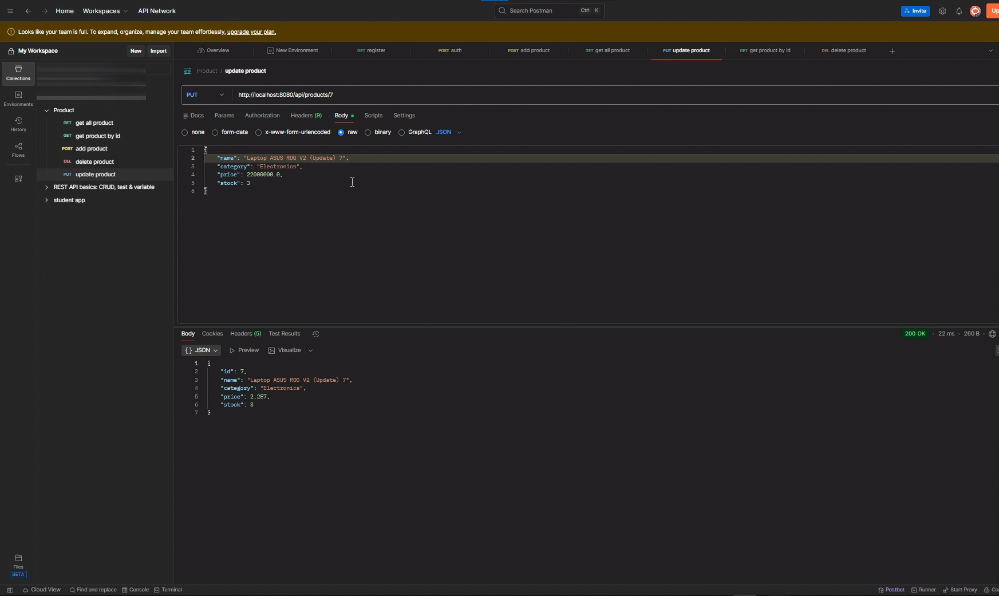
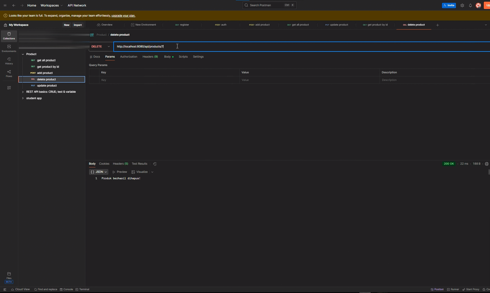

# 📦 Product Management System (RESTful API)

[](https://www.oracle.com/java/technologies/downloads/)
[](https://spring.io/projects/spring-boot)
[](https://www.mysql.com/)

## 📝 Deskripsi Project
Project ini adalah aplikasi backend berbasis **Spring Boot** untuk mengelola data inventaris produk. Aplikasi ini mengimplementasikan operasi **CRUD** (Create, Read, Update, Delete) dan menggunakan **Layered Architecture** untuk memastikan kode terstruktur, mudah dikelola, dan skalabel.

##  Fitur Utama
* **CRUD Operations**: Mengelola data produk secara lengkap.
* **Input Validation**: Memastikan data yang masuk (nama, harga, stok) valid sebelum disimpan.
* **Global Error Handling**: Menampilkan pesan error yang rapi dan informatif dalam format JSON.
* **Modern Java**: Menggunakan fitur **Java 21 Records** untuk DTO yang lebih ringkas.

## 🏗️ Layered Architecture
Project ini dibagi menjadi beberapa lapisan tanggung jawab:
1. **Controller**: Menangani request HTTP dari client (Postman).
2. **Service**: Berisi logika bisnis utama aplikasi.
3. **Repository**: Menangani komunikasi data dengan database MySQL menggunakan Spring Data JPA.
4. **Entity**: Representasi tabel database dalam bentuk objek Java.
5. **DTO (Data Transfer Object)**: Media pertukaran data antara client dan server, sekaligus tempat validasi input.
   
### 📸 Dokumentasi Postman

**1. Tambah Produk (POST)**


**2. List Produk (GET ALL)**


**3. List Produk (GET BY ID)**


**2. Update Produk (UPDATE)**



**5. Delete Produk (DELETE)**



## 📁 Struktur Folder
```text
src/main/java/com/product/demo
 ├── controller
 │    └── ProductController.java       # REST Endpoints
 ├── service
 │    └── ProductService.java          # Business Logic
 ├── repository
 │    └── ProductRepository.java       # Database Access (JPA)
 ├── entity
 │    └── Product.java                 # Database Model
 ├── dto
 │    └── ProductRequestDTO.java       # Data Validation (Record)
 ├── exception
 │    └── GlobalExceptionHandler.java  # Error Handling
 └── DemoApplication.java              # Main Class

